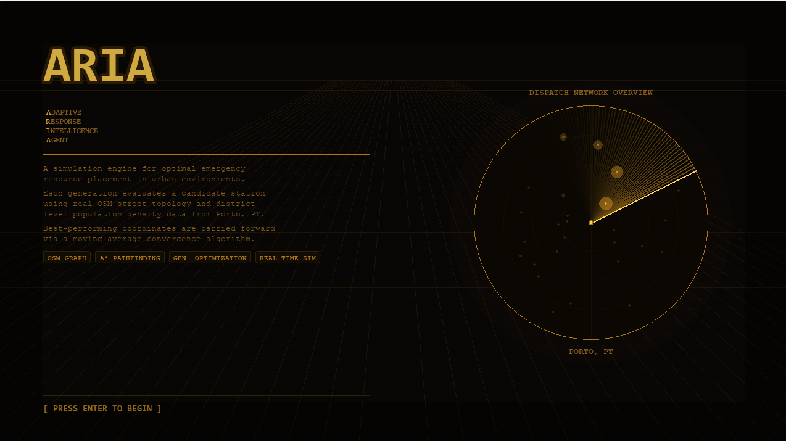
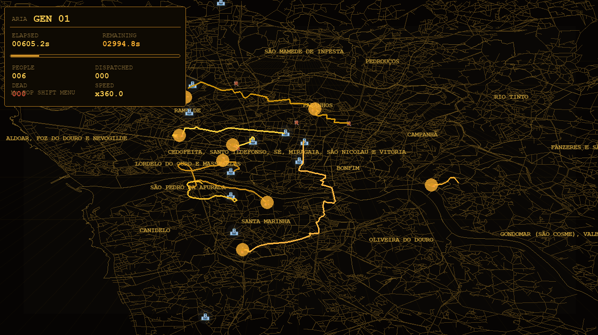
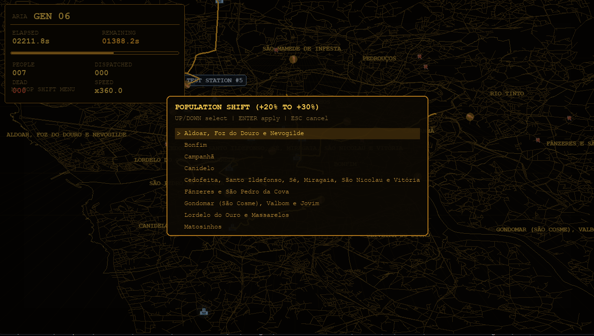

# ARIA — Adaptive Response Intelligence Agent


> A real-time emergency dispatch simulator that uses generational optimization to recommend optimal ambulance station placement — built on real OpenStreetMap data from Porto, Portugal.

---

## Showcase

| Title Screen | Simulation | End-of-Run Report |
|:---:|:---:|:---:|
|  |  |  |

📹 **[Watch full demo (SHOWCASE.mp4)](SHOWCASE.mp4)**

---

## What is ARIA?

ARIA simulates emergency medical demand across Porto's real urban road network. Ambulances are dispatched from actual station locations using A\* pathfinding on the OSM street graph. Each timed **generation** tracks how many people survive, and a **moving-average convergence algorithm** continuously repositions a candidate "ghost station" toward the city's mortality hotspot.

The goal: after enough generations, ARIA converges on the coordinates where a new ambulance base would save the most lives.

---

## Technical Highlights

### Geospatial Pipeline
- Loads and caches Porto's full drive-network graph via **OSMnx** (`.graphml`)
- Attaches each graph node to its **freguesia** (district) using a spatial join with **GeoPandas**
- Computes and caches screen-space projections for zero-cost rendering

### Pathfinding
- **A\* via NetworkX** with Euclidean heuristic, running on a background `ThreadPoolExecutor`
- Edge traversal respects real **OSM `maxspeed`** values, including mph→km/h conversion and list-valued attributes
- Path waypoints are densified from edge geometry for smooth ambulance movement

### Generational Optimization
- Each generation runs for a configurable simulated hour with randomised spawn intensity
- Per-generation deaths are geolocated; the system tracks a **rolling 10-generation average death centroid**
- An exponential moving average (α = 0.1) smooths the candidate station position across generations, converging on high-mortality zones

### Dynamic Population Shifts
- Spawn probability is weighted by district population density (`FREGUESIA_WEIGHTS`)
- Mid-simulation **population shift events** boost a selected freguesia by 20–30 %, redistributing the remaining weight proportionally — modelling real urban demand shocks

### Rendering
- Retro **amber phosphor CRT aesthetic** (scanlines, perspective grid, pulsing glows)
- Animated radar sweep on the title screen
- Ambulance path trails pre-computed to screen space at spawn time for GPU-friendly batch blitting
- Hover-responsive station labels, ripple dispatch animations, and beacon pulses

---

## Architecture

```
main.py              Entry point
├── game.py          Main loop · HUD · event handling · population shift UI
├── map.py           OSMnx graph loading · freguesia spatial join · screen projection · rendering
├── entities.py      Hospital · Person · Ambulance classes · dispatch logic
├── generations.py   Generation timing · weighted spawning · death tracking · ghost-station EMA
├── pathfinding.py   A* wrapper · nearest-node lookup
├── helpers.py       Haversine distance · coordinate transforms · color interpolation
├── settings.py      Simulation constants · amber/blue palette · spawn parameters
├── title_screen.py  Animated radar title screen
├── loading_screen.py  Retro loading interface
└── end_game_screen.py  Final stats · recommended station coordinates
```

Data files (included):
- `porto_map.graphml` — cached OSM street graph for Porto
- `porto_freguesias.gpkg` — GeoPackage with district boundary polygons

---

## Quick Start

### Prerequisites
- Python 3.10+
- pip

### Install

```bash
git clone https://github.com/okupacolossal/ARIA.git
cd ARIA
pip install -r requirements.txt
```

### Run

```bash
python main.py
```

The first launch loads the cached map files. If they are absent, OSMnx will download them automatically (requires internet).

---

## Controls

| Key | Action |
|-----|--------|
| `ENTER` / `SPACE` | Start simulation from title screen |
| `ESC` | End simulation → show final report |
| `↑` / `→` | Double simulation speed |
| `↓` / `←` | Halve simulation speed |
| `M` | Open population shift selector |
| `↑` / `↓` in selector | Navigate districts |
| `ENTER` in selector | Apply population shift |
| `ESC` in selector | Cancel |

---

## End-of-Run Report

When you press `ESC`, ARIA displays:

- Total generations completed
- Total deaths and ambulances dispatched
- Average deaths per generation
- Mortality rate
- **Recommended new station coordinates** (lat/lon centroid of cross-generation death hotspots)

---

## Skills Demonstrated

| Domain | Specifics |
|--------|-----------|
| Geospatial data | OSM graph ingestion, GeoPackage I/O, CRS-aware spatial joins, coordinate projection |
| Graph algorithms | A\* pathfinding, edge geometry traversal, nearest-node lookup |
| Simulation design | Time-compressed event loop, weighted stochastic spawning, multi-entity state machines |
| Optimisation | Generational moving-average convergence, dynamic weight redistribution |
| Concurrency | Thread-pool async pathfinding with done-callbacks |
| Rendering | Pygame game loop, pre-computed screen-space caches, layered alpha compositing |
| Data engineering | Per-generation statistics accumulation, heuristic decision support output |

---

## License

MIT — see [LICENSE](LICENSE) for details.
